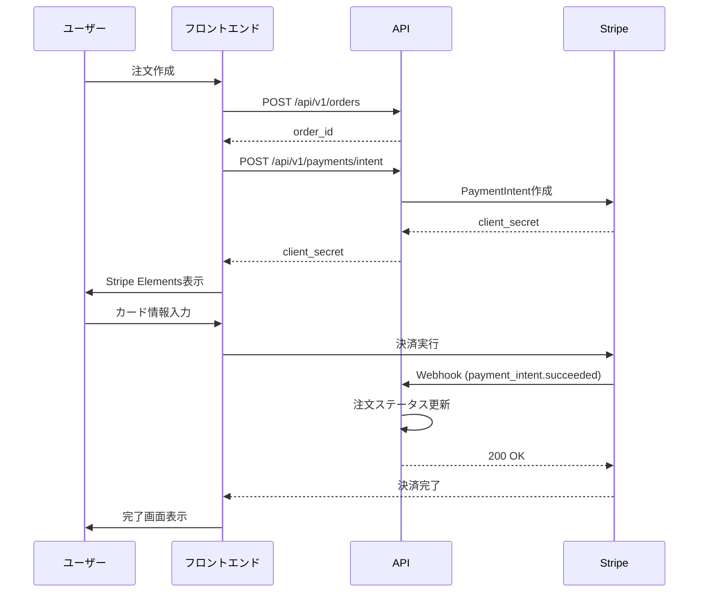

# Stripe決済 実装ガイド

## 概要

SpiromでStripe決済を実装するためのガイドです。このガイドでは、Stripe APIの基本的な使い方と、Stripe MCP（Model Context Protocol）を使った開発をサポートします。

---

## 必要なパッケージ

### フロントエンド (apps/web)

```bash
npm install @stripe/stripe-js @stripe/react-stripe-js --workspace=apps/web
```

| パッケージ | 用途 |
|-----------|------|
| `@stripe/stripe-js` | Stripe.js SDK（決済UI、カード入力） |
| `@stripe/react-stripe-js` | React用コンポーネント（Elements、CardElement等） |

### バックエンド (apps/bff - Rust)

```toml
# Cargo.toml に追加
[dependencies]
reqwest = { version = "0.11", features = ["json"] }  # Stripe API呼び出し用
hmac = "0.12"  # Webhook署名検証用
```

> **注意**: Rust用の公式Stripe SDKはないため、REST APIを直接呼び出します。

---

## Stripeダッシュボードで必要なもの

### 1. APIキー（必須）

| キー | 用途 | 保存場所 |
|------|------|----------|
| `STRIPE_PUBLISHABLE_KEY` | フロントエンド用（`pk_test_...` / `pk_live_...`） | `.env.local` |
| `STRIPE_SECRET_KEY` | バックエンド用（`sk_test_...` / `sk_live_...`） | Cloudflare Secrets |
| `STRIPE_WEBHOOK_SECRET` | Webhook署名検証用（`whsec_...`） | Cloudflare Secrets |

### 2. Webhook設定

Stripeダッシュボード → Developers → Webhooks で以下のエンドポイントを登録:

```
https://your-domain.com/api/stripe/webhook
```

**必要なイベント:**
- `checkout.session.completed` - 決済完了
- `payment_intent.succeeded` - 支払い成功
- `payment_intent.payment_failed` - 支払い失敗

---

## 推奨する決済フロー

### Stripe Checkout（推奨）

Stripeがホストする決済ページを使用。最も簡単で安全。

```
[カート] → [Checkout Session作成] → [Stripe決済ページ] → [完了ページ]
```

**メリット:**
- PCI DSS準拠が簡単
- カード情報を自サーバーで扱わない
- 多様な決済方法に自動対応

### カスタム決済フォーム（上級者向け）

自前のUIでカード入力。

```
[カート] → [PaymentIntent作成] → [カード入力UI] → [確認] → [完了]
```

---

## 実装例

### 1. 環境変数

```env
# apps/web/.env.local
NEXT_PUBLIC_STRIPE_PUBLISHABLE_KEY=<your-stripe-publishable-key>

# ⚠️ 注意: StripeのPrice ID / Product ID を `NEXT_PUBLIC_*` で公開しないでください。
# 本実装では「DBの商品ID」を送って、サーバー側で金額/税/送料/在庫ロックを確定します。
```

```toml
# Cloudflare Workers (wrangler.toml)
[vars]
# 本番用はCloudflare Secretsを使用
```

```bash
# Cloudflare Secretsの設定（本番用）
npx wrangler secret put STRIPE_SECRET_KEY
npx wrangler secret put STRIPE_WEBHOOK_SECRET
```

### 2. ✅ 推奨フロー（本実装）

**クライアントに金額/税/送料/通貨/割引計算をさせない**前提で、以下のAPIを利用してください。

- `POST /api/v1/orders`（itemsは`product_id`と`quantity`のみ）
- `POST /api/v1/payments/intent`（`order_id`のみ）
- Webhook: `POST /api/v1/webhooks/stripe`（署名検証 + 冪等性 + 金額再検証）

### 3. ❌ 非推奨（危険な例）
以下は要件上NGです:

- クライアントが `price`/`amount` を渡して決済を作る
- `success_url` / `cancel_url` をクライアントから動的に渡す
- StripeのPrice ID / Product ID をクライアントに公開する

（上記NG例に該当するCheckout Session実装サンプルは、セキュリティ要件に反するため本ガイドから削除しました）

```tsx
// apps/web/src/components/checkout/CheckoutButton.tsx
'use client'

import { createCheckoutSession } from '@/app/cart/actions';

export function CheckoutButton({ items }: { items: CartItem[] }) {
  const handleCheckout = async () => {
    const url = await createCheckoutSession(items);
    window.location.href = url;  // Stripe決済ページへリダイレクト
  };

  return (
    <button onClick={handleCheckout}>
      購入手続きへ
    </button>
  );
}
```

### 4. Webhook処理 (BFF)

```rust
// apps/bff/src/handlers/webhook.rs

use hmac::{Hmac, Mac};
use sha2::Sha256;

pub async fn handle_stripe_webhook(
    req: Request,
    ctx: &RouteContext<()>,
) -> Result<Response> {
    let webhook_secret = ctx.secret("STRIPE_WEBHOOK_SECRET")?.to_string();
    let signature = req.headers().get("stripe-signature")?.unwrap_or_default();
    let body = req.text().await?;

    // 署名検証
    if !verify_signature(&body, &signature, &webhook_secret) {
        return Response::error("Invalid signature", 400);
    }

    let event: serde_json::Value = serde_json::from_str(&body)?;
    let event_type = event["type"].as_str().unwrap_or_default();

    match event_type {
        "checkout.session.completed" => {
            let session = &event["data"]["object"];
            let session_id = session["id"].as_str().unwrap_or_default();
            let customer_email = session["customer_details"]["email"].as_str();

            // 注文処理（DB保存、メール送信等）
            // TODO: 実装
        }
        "payment_intent.payment_failed" => {
            // 失敗処理
        }
        _ => {}
    }

    Response::ok("OK")
}

fn verify_signature(payload: &str, signature: &str, secret: &str) -> bool {
    // Stripe署名検証ロジック
    // 実装省略
    true
}
```

---

## 対応する決済方法

Stripe Checkoutを使うと以下が自動で利用可能:

| 決済方法 | 設定 |
|----------|------|
| クレジットカード | デフォルトで有効 |
| Apple Pay | ドメイン認証後に自動有効 |
| Google Pay | 自動有効 |
| コンビニ決済 | ダッシュボードで有効化 |
| 銀行振込 | ダッシュボードで有効化 |

---

## テスト用カード番号

| カード番号 | 説明 |
|------------|------|
| `4242 4242 4242 4242` | 成功 |
| `4000 0000 0000 9995` | 残高不足で失敗 |
| `4000 0000 0000 0002` | カード拒否 |

有効期限: 未来の任意の日付
CVC: 任意の3桁

---

## セキュリティチェックリスト

- [ ] Secret KeyはCloudflare Secretsに保存（コードにハードコードしない）
- [ ] Webhook署名を必ず検証する
- [ ] HTTPSを使用する
- [ ] 本番環境では`pk_live_`/`sk_live_`キーを使用
- [ ] 金額計算はサーバーサイドで行う（フロントから渡された金額を信用しない）

---

---

## バックエンド実装状況

### ✅ 実装済み機能

#### 1. **決済プロバイダー実装** (`apps/api/src/services/payment/`)
- ✅ `PaymentProvider` トレイト定義
- ✅ `StripePaymentProvider` 実装
- ✅ PaymentIntent作成
- ✅ 決済確認
- ✅ 返金処理
- ✅ Webhook署名検証

#### 2. **決済ハンドラー** (`apps/api/src/handlers/payments.rs`)
- ✅ `POST /api/v1/payments/intent` - PaymentIntent作成
- ✅ `POST /api/v1/payments/confirm` - 決済確認（テスト用）
- ✅ `POST /api/v1/payments/refund` - 返金処理
- ✅ `POST /api/v1/webhooks/stripe` - Webhook受信

#### 3. **注文リポジトリ拡張** (`apps/api/src/db/repositories/order_repository.rs`)
- ✅ `update_payment_id` - 決済IDの保存
- ✅ `update_payment_status` - 決済ステータス更新

#### 4. **APIルーティング** (`apps/api/src/routes/mod.rs`)
- ✅ 認証必須の決済エンドポイント
- ✅ 公開Webhookエンドポイント（署名検証あり）

### 🔒 セキュリティ実装

- ✅ Webhook署名検証（HMAC-SHA256）
- ✅ 認証ユーザーの注文所有権チェック
- ✅ 決済ステータスによる操作制限
- ✅ 環境変数からのAPIキー読み込み

### 📋 決済フロー



### 環境変数の設定

```.env
# apps/api/.env
STRIPE_SECRET_KEY=<your-stripe-secret-key>
STRIPE_WEBHOOK_SECRET=<your-webhook-secret>
```

### テスト方法

#### 1. ローカルでのWebhookテスト

Stripe CLIを使用してローカルでWebhookをテストできます:

```bash
# Stripe CLIでWebhookをフォワード
stripe listen --forward-to localhost:8000/api/v1/webhooks/stripe

# 表示されたWebhook秘密鍵を.envに設定
STRIPE_WEBHOOK_SECRET=<your-webhook-secret>
```

#### 2. PaymentIntentのテスト

```bash
# PaymentIntent作成
curl -X POST http://localhost:8000/api/v1/payments/intent \
  -H "Authorization: Bearer YOUR_JWT_TOKEN" \
  -H "Content-Type: application/json" \
  -d '{"order_id": "order-uuid-here"}'

# レスポンス例
{
  "data": {
    "client_secret": "pi_xxx_secret_xxx",
    "payment_intent_id": "pi_xxx"
  }
}
```

#### 3. Webhookイベントのトリガー

```bash
# テストイベントを送信
stripe trigger payment_intent.succeeded
```

---

## 参考: Stripeリソース管理（重要）

- **StripeのProduct/Price/Customer IDや支払いリンクURL、APIキー等の実値はリポジトリに書かないでください。**
- 本番/テストのリソースIDは、StripeダッシュボードやSecrets管理で運用してください。

本実装では **「DBの商品ID」→サーバー側で金額確定→PaymentIntent作成→Webhookで確定** を前提にしています。

---

## Stripe MCP (Model Context Protocol) の使用

Stripe MCPを使用すると、AI エージェントが Stripe API と直接対話し、ドキュメントを検索できます。開発時にStripeリソースの管理やトラブルシューティングを効率化できます。

### Stripe MCPとは

Stripe MCPは、AI エージェントが Stripe API を操作し、ドキュメントやサポート記事を検索するためのツールセットです。

**主な機能:**
- Stripeリソース（顧客、商品、価格、支払いリンク、インボイスなど）の作成・管理
- Stripeドキュメントの検索
- 支払いの確認、返金、サブスクリプション管理
- クーポンの作成と管理

### Stripe MCPの接続方法

#### Cursorで使用する場合

Cursorの設定ファイル（`~/.cursor/mcp.json`）に以下を追加:

```json
{
  "mcpServers": {
    "stripe": {
      "url": "https://mcp.stripe.com"
    }
  }
}
```

#### VS Codeで使用する場合

ワークスペースの`.vscode/mcp.json`に以下を追加:

```json
{
  "mcpServers": {
    "stripe": {
      "type": "http",
      "url": "https://mcp.stripe.com"
    }
  }
}
```

### OAuth認証

Stripe MCPサーバーは OAuth を使用して接続します。初回接続時にOAuth同意画面が表示され、Stripeアカウントへのアクセスを承認します。

**注意:** 管理者権限が必要です。

### Stripe MCPで利用可能な操作例

#### 1. 顧客の作成

```typescript
// MCPツールを使用して顧客を作成
// AIエージェントが自動的に mcp_stripe_create_customer を呼び出します
```

#### 2. 商品と価格の作成

```typescript
// 商品と価格を順次作成
// 1. 商品作成: mcp_stripe_create_product
// 2. 価格作成: mcp_stripe_create_price
```

#### 3. 支払いリンクの作成

```typescript
// 価格IDを使用して支払いリンクを作成
// mcp_stripe_create_payment_link
```

#### 4. ドキュメント検索

```typescript
// Stripeドキュメントを検索
// mcp_stripe_search_stripe_documentation
```

### Stripe MCPツール一覧

| ツール名 | 説明 |
|---------|------|
| `mcp_stripe_create_customer` | 顧客を作成 |
| `mcp_stripe_list_customers` | 顧客一覧を取得 |
| `mcp_stripe_create_product` | 商品を作成 |
| `mcp_stripe_list_products` | 商品一覧を取得 |
| `mcp_stripe_create_price` | 価格を作成 |
| `mcp_stripe_list_prices` | 価格一覧を取得 |
| `mcp_stripe_create_payment_link` | 支払いリンクを作成 |
| `mcp_stripe_create_invoice` | インボイスを作成 |
| `mcp_stripe_list_invoices` | インボイス一覧を取得 |
| `mcp_stripe_create_refund` | 返金を作成 |
| `mcp_stripe_list_subscriptions` | サブスクリプション一覧を取得 |
| `mcp_stripe_create_coupon` | クーポンを作成 |
| `mcp_stripe_search_stripe_documentation` | Stripeドキュメントを検索 |
| `mcp_stripe_get_stripe_account_info` | アカウント情報を取得 |

### ローカルサーバーの使用

ローカル環境でMCPサーバーを実行する場合:

```bash
npx -y @stripe/mcp --tools=all
```

環境変数でAPIキーを指定:

```bash
STRIPE_SECRET_KEY=sk_test_... npx -y @stripe/mcp --tools=all
```

> **セキュリティ推奨事項:** ローカルサーバーでは[制限付きAPIキー](https://docs.stripe.com/keys#create-restricted-api-secret-key)の使用を推奨します。

### 開発ワークフローでの活用例

#### 1. テストデータの作成

開発中、テスト用の顧客・商品・価格をMCPで作成できます。

#### 2. トラブルシューティング

決済の問題発生時、MCPでドキュメントを検索して解決方法を探せます。

#### 3. サブスクリプション管理

サブスクリプションの作成、更新、キャンセルをMCPで実行できます。

#### 4. 返金処理

支払いの返金が必要な場合、MCPで返金を作成できます。

### 詳細情報

- [Stripe MCP 公式ドキュメント](https://docs.stripe.com/mcp)
- [Stripe MCP ツール一覧](https://docs.stripe.com/mcp#tools)
- [Model Context Protocol 仕様](https://modelcontextprotocol.io/)

---

## 参考リンク

### Stripe API関連
- [Stripe Checkout ドキュメント](https://stripe.com/docs/checkout)
- [Stripe API リファレンス](https://stripe.com/docs/api)
- [Stripe Webhook ガイド](https://stripe.com/docs/webhooks)
- [Stripe.js リファレンス](https://stripe.com/docs/js)

### Stripe MCP関連
- [Stripe MCP ドキュメント](https://docs.stripe.com/mcp)
- [Stripe Agent Toolkit](https://docs.stripe.com/agents)
- [Stripe LLM 統合](https://docs.stripe.com/building-with-llms)

---

## 実装ステップ

1. Stripeアカウント作成・APIキー取得
2. Stripe MCPの設定（開発効率化のため推奨）
3. パッケージインストール
4. 環境変数設定
5. BFF/BackendにPaymentIntent作成API（注文IDベース）を実装
6. フロントエンドにCheckoutボタン実装
7. Webhook処理を実装
8. テストモードで動作確認（Stripe MCPでテストデータ作成も可）
9. 本番キーに切り替えてデプロイ

---

## Stripe MCPを使った開発のベストプラクティス

### 1. 開発環境のセットアップ

開発時にStripe MCPを使用することで、以下の作業を効率化できます:

- **テストデータの作成**: 顧客、商品、価格を簡単に作成
- **ドキュメント検索**: 実装中にリアルタイムでStripeドキュメントを検索
- **デバッグ支援**: 支払いやサブスクリプションの状態を確認

### 2. テストシナリオの構築

Stripe MCPを使って、以下のようなテストシナリオを構築できます:

```typescript
// 1. テスト用顧客を作成
const customer = await mcp_stripe_create_customer({
  name: "テストユーザー",
  email: "test@example.com"
});

// 2. テスト用商品を作成
const product = await mcp_stripe_create_product({
  name: "テスト商品",
  description: "これはテスト商品です"
});

// 3. テスト用価格を作成
const price = await mcp_stripe_create_price({
  product: product.id,
  unit_amount: 1000, // 10.00 USD
  currency: "usd"
});

// 4. 支払いリンクを作成してテスト
const paymentLink = await mcp_stripe_create_payment_link({
  price: price.id,
  quantity: 1
});
```

### 3. トラブルシューティング

決済で問題が発生した場合、Stripe MCPのドキュメント検索機能を使用:

```typescript
// エラーコードや問題に関する情報を検索
const docs = await mcp_stripe_search_stripe_documentation({
  question: "payment_intent.payment_failed エラーの対処法",
  language: "node"
});
```

### 4. 本番環境での注意事項

- 本番環境では制限付きAPIキーを使用
- OAuth接続の管理を適切に行う（不要な接続は削除）
- テストデータと本番データを区別する

---

## 実装チェックリスト

- [ ] Stripeアカウント作成完了
- [ ] APIキー取得（テスト・本番）
- [ ] Stripe MCP設定（開発環境）
- [ ] パッケージインストール完了
- [ ] 環境変数設定完了
- [ ] PaymentIntent作成API（注文IDベース）実装
- [ ] Webhook処理実装
- [ ] Webhook署名検証実装
- [ ] フロントエンド実装
- [ ] テストモードでの動作確認
- [ ] 本番環境での最終確認
